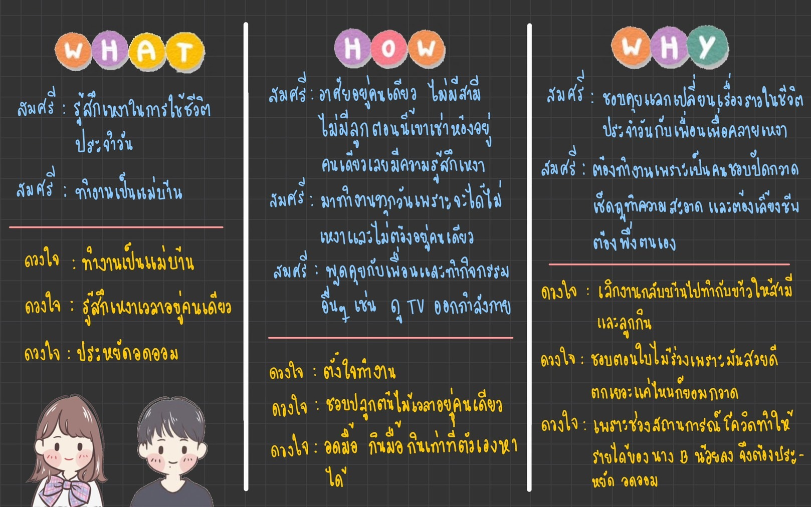
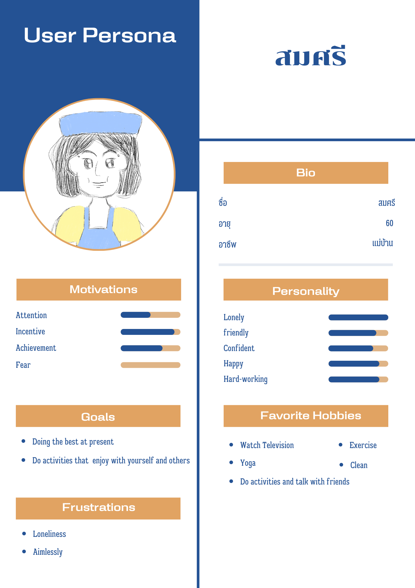
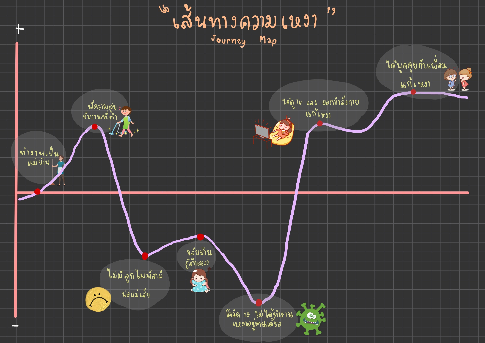
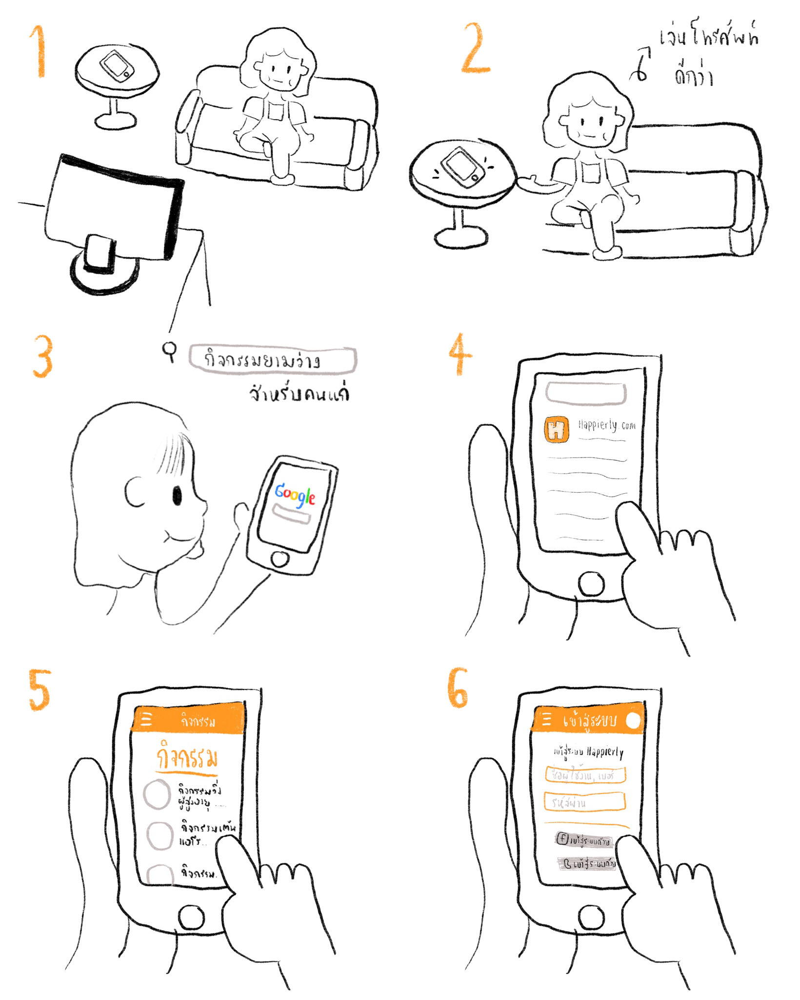
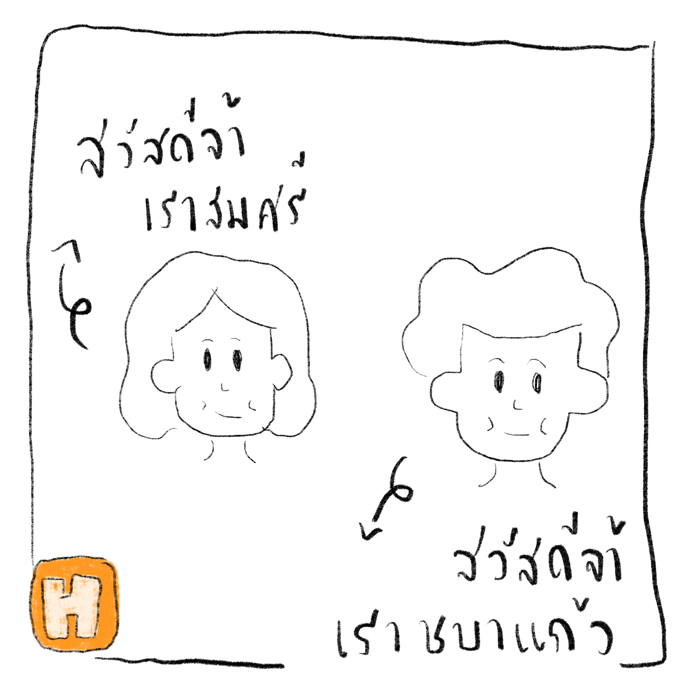

# สัมภาษณ์  :speech_balloon:
 

## นาง สมศรี 	&nbsp; :red_haired_woman:

 

 | คำถามสัมภาษณ์ |    คำตอบ    | 
 | --------- | -------------- |
  1.ช่วยเล่าชีวิตประจำวันให้ฟังหน่อยได้มั้ย | - ก็ทำงานเป็นแม่บ้านตามปกติ คอยปัดกวาดเช็ดถู ทำความสะอาดส่วนต่างๆภายในอาคารค่ะ
 2.ชีวิตประจำวันปกติของคุณอยู่กับใครบ้าง | - ปกติอยู่คนเดียว ไม่มีสามีไม่มีลูก พ่อแม่ก็เสียไปหมดแล้ว ตอนนี้เลยเช่าห้องอยู่คนเดียว
 3.เหงาไหมเวลาอยู่คนเดียว | - ส่วนตัวก็มีเหงาอยู่บ้างเวลาอยู่คนเดียว แต่ก็ถ้าได้อยู่กับเพื่อนหรือถ้ามีกิจกรรมทำตอนอยู่คนเดียวก็จะไม่เหงาเท่าไหร่
 4.การเตรียมตัวเข้าสู่วัยสูงอายุ  | - ตอนนี้ยังไม่รู้ว่าจะต้องเตรียมตัวยังไง รอถึงเวลานั้นแล้วค่อยเตรียมตัวเอา ตอนนี้ขอทำหน้าที่ของตัวเองให้ดีก่อนละกันค่ะ
 5.ชีวิตประจำวันปกติถ้าไม่ทำงานทำไรบ้าง | - ก็จะดู TV แก้เหงาเวลาอยู่คนเดียว บ้างก็ไปออกกำลังกาย เล่นโยคะ 
 6.ปัจจุบันยังทำงานอยู่ไหม | - ปัจจุบันยังทำงานอยู่ค่ะ   
 7.แล้วมีความสุขกับงานที่ทำไหม | - มีความสุขมากกกกกับงานที่ทำ เพราะเป็นคนชอบปัดกวาดเช็ดถู ทำความสะอาดนู่นนี่นั่นอยู่แล้ว
 8.การเป็นผู้สูงอายุ ทำให้เราต้องพึ่งพาคนอื่นมากขึ้นมั้ย ถ้าใช่ คุณรู้สึกอย่างไรบ้างกับการที่ต้องพึ่งพาคนอื่น |  - เนื่องจากว่าตอนนี้เราเองก็อยู่ตัวคนเดียว มันเลยไม่มีใครให้พึ่ง เราก็ได้แต่พึ่งตนเอง
 9.กลัวไหมที่จะเข้าสู่วัยผู้สูงอายุ | - ไม่กลัว เพราะ ยิ่งส่วนตัวแล้วเราเองก็อยู่คนเดียวด้วย ไม่มีใครมาคอยดูแลเรา ดังนั้นเราจึงต้องเข้มแข็งเข้าไว้ ต้องอยู่กับมันให้ได้
 10.ในช่วงสถานการณ์โควิดที่ต้องกักตัวอยู่แต่ในบ้านส่งผลกระทบอย่างไรกับคุณบ้าง   | - ก็อาจจะมีเหงาบ้างเวลาอยู่คนเดียว งานก็ไม่ได้ทำ รายได้เราก็เลยลดลงตามไปด้วย สำหรับเราก็กระทบอยู่พอสมควร
 
  
 
## นาง ดวงใจ &nbsp; :curly_haired_woman:

 

 | คำถามสัมภาษณ์ |    คำตอบ    | 
 | --------- | -------------- |
 1.ช่วยเล่าชีวิตประจำวันให้ฟังหน่อยได้มั้ย  | - ทำงานเป็นแม่บ้านปกติ เลิกงานก็กลับบ้านไปทำกับข้าวให้สามีกับลูกกิน
 2.ชีวิตประจำวันปกติของคุณอยู่กับใครบ้าง |- อยู่กับสามีและลูก ส่วนหลานอยู่คอนโดก็อาจจะมีแวะมาเยี่ยมบ้าง
 3.มีกิจกรรมอะไรที่ชอบทำเป็นพิเศษ | - ชอบปลูกต้นไม้
 4.ทำไมถึงชอบทำกิจกรรมนั้น | - ชอบเพราะทำมาตั้งแต่เด็กและก็ชอบตอนใบไม้มันร่วง มันสวยดี ตกเยอะแค่ไหนก็ยอมกวาด
 5.การเตรียมตัวเข้าสู่วัยสูงอายุ | - ก็มีออมเงินไว้ซื้อบ้านและตอนนี้ก็สร้างบ้านเสร็จแล้ว
 6.อะไรที่ต้องรักษาไว้เมื่อเข้าสู่วัยผู้สูงอายุ | - สมบัติของพ่อ เพราะถ้าไม่มีเงินไว้ใช้เมื่อไหร่ก็จะเอาไปจำนำมาใช้
 7.ปัจจุบันทำอะไรอยู่   | - ปัจจุบันก็ทำงานเป็นแม่บ้านที่มหาลัยนี้แหละ
 8.แล้วเงินที่ได้จากการทำงานคุณเอาไว้ใช้ทำอะไร | - ก็เก็บออมไว้ใช้ตอนเข้าวัยสูงอายุ
 9.หลังจากปลดระวางจากการทำงานแล้ว | - มีกิจกรรมอะไรที่อยากทำเป็นพิเศษ อยากไปทำนา เพราะ ทำมาแต่เด็ก
 10.กลัวไหมที่จะเข้าสู่วัยผู้สูงอายุ | - ไม่กลัว เพราะเตรียมตัวมาแล้วมีบ้านมีเงินออมไว้แล้ว
 11.บทบาทภายในครอบครัว | - ก็ทำงานและก็ทำกับข้าวให้คนในบ้านกิน
 12.ในช่วงสถานการณ์โควิดที่ต้องกักตัวอยู่แต่ในบ้านส่งผลกระทบอย่างไรกับคุณบ้าง | - ก็ต้องประหยัดเงินไว้ มีอดมื้อกินมื้อบ้างแต่ก็ผ่านมาได้ 
 13.เหงาไหมเวลาอยู่คนเดียว | - เหงา เพราะปกติเราก็อยู่กับครอบครัวตลอดไม่ค่อยห่างจากใครเท่าไหร่

---
# What-How-Why :loudspeaker::bulb:

# Say-Do-Think-Feel :busts_in_silhouette:

1. **Say** :speech_balloon: 

| นาง สมศรี |   ปกติอยู่คนเดียว ไม่มีสามีไม่มีลูก พ่อแม่ก็เสียไปหมดแล้ว   | 
 | --------- | -------------- |
 **นาง ดวงใจ**   | **อยู่กับสามีและลูก ส่วนหลานอยู่คอนโดก็อาจจะมีแวะมาเยี่ยมบ้าง**

2. **Do** :muscle:

| นาง สมศรี |   ดู TV ออกกำลังกาย เล่นโยคะ คอยปัดกวาดเช็ดถู ทำความสะอาดส่วนต่างๆภายในอาคาร คุยกับเพื่อนๆ   | 
 | --------- | -------------- |
 **นาง ดวงใจ** | **ปลูกต้นไม้ ทำนา กวาดใบไม้**

3. **Think** :thought_balloon:

| นาง สมศรี |    เหงาเป็นบางครั้ง แต่ก็ต้องเข้มแข็งและพึ่งพาตัวเอง  | 
 | --------- | -------------- |
 **นาง ดวงใจ**  | **เหงา เพราะปกติเราก็อยู่กับครอบครัวตลอดไม่ค่อยห่างจากใครเท่าไหร่**

4. **Feel** :trollface:

| นาง สมศรี |    โดดเดี่ยว เคว้งคว้าง     | 
 | --------- | -------------- |
 **นาง ดวงใจ** | **มีความสุขเมื่อกลับบ้าน**

---

# User Persona :older_woman: :

 # Journey Map :chart_with_upwards_trend: :
 
 
  

# Need&Insights : :scroll:
|**Need**  |**insight** |
| --------- | -------------- |
| User ทำกิจกรรมต่างๆหรือหาเพื่อนมาพูดคุย| User ไม่ต้องการรู้สึกโดดเดี่ยวเลยต้องหากิจกรรมทำด้วยตัวเองคนเดียว |

 

---
# Point of View :bouquet:
1. We met / เราพบใคร
- [x] **เจอป้าแม่บ้าน ที่ใช้ชีวิตอยู่คนเดียว ไม่มีครอบครัว ไม่มีลูก ไม่มีสามี**
2. We were surprised to notice / พฤติกรรมที่แปลกของเขาที่เราประหลาดใจ
- [x] **แปลกใจที่ป้าไม่รู้สึกเหงาเลย สามารถอยู่คนเดียวได้**
3. We wonder if this means / เหตุผลที่เขาทำพฤติกรรมนั้น
- [x] **หรือมันเป็นเพราะว่า  ป้าแม่บ้านหากิจกรรมทำด้วยตัวเองคนเดียว เพื่อที่ตัวเองจะไม่รู้สึกเหงา**
4. It would be a game-changing to / อะไรที่จะเปลี่ยนผลลัพธ์ของเขา
- [x] **จะดีมากเลยถ้าเขาเจอเพื่อนที่อยากคุย หรือ คนอื่นๆ ในช่วงวัยเดียวกัน**

---
# Ideate :sun_with_face:
สมาชิกทุกคนได้นำเสนอ idea โดยมีไอเดียต่อไปนี้ เว็บไซต์ community สำหรับผู้สูงอายุ(เสนอโดย Pheeraphat47),จัดกิจกรรมให้ผู้สูงอายุให้มาพบเจอกัน ออกกำลังกายตามสวนสาธารณะ (เสนอโดย guypyt) ,application สำหรับพูดคุยกัน(เสนอโดย jirananyenlab),บ้านพักคนชรา(เสนอโดย jirananyenlab),บอร์ดประกาศกิจกรรมสำหรับผู้สูงอายุบนแพลตฟอรม์ออนไลน์(เสนอโดย moodmoon),ชมรมผู้สูงอายุ(เสนอโดย DekchaiHeart),ตลาดผู้สูงอายุ(เสนอโดย DekchaiHeart) ,สร้างหุ่นยนต์คุยกับผู้สูงอายุแก้เหงา(เสนอโดย yadajen) ,แอพลิเคชั่นสำหรับผู้สูงอายุ ไว้แลกเปลี่ยนกิจกรรมกันในแต่ละวัน(เสนอโดย moodmoon)
จากนั้นได้ทำการจัดหมวดหมู่แต่ละไอเดีย โดยจัดเป็นดังนี้  
| rational choice |   delight    | darling  | long shot |
| --------- | -------------- |-------------- |-------------- |
| จัดกิจกรรมให้ผู้สูงอายุ ให้มาพบเจอกัน ออกกำลังกายตามสวนสาธารณะ| บ้านพักคนชรา| เว็บไซต์ community สำหรับผู้สูงอายุ |สร้างหุ่นยนต์คุยกับผู้สูงอายุแก้เหงา | 
| บอรด์ประกาศกิจกรรมสำหรับผู้สูงอายุบนแพลตฟอรม์ออนไลน์ | ชมรมผู้สูงอายุ |application สำหรับพูดคุยกัน |- |
| แอพลิเคชั่นสำหรับผู้สูงอายุ ไว้แลกเปลี่ยนกิจกรรมกันในแต่ละวัน| -|ตลาดผู้สูงอายุ  | - |

**และให้สมาชิกแต่ละคนโหวต idea ที่ชอบในแต่ละหัว โดยได้ idea สุดท้ายที่ทุกคนชอบ และมีความเป็นไปได้ที่จะสามารถทำให้เป็นจริงได้คือ idea  เว็บไซต์ community สำหรับผู้สูงอายุ**

*จัดทำโดย Nitchan Konkit*
---
# Prototype :key:
[Prototype](./Prototype-INT100.pdf)
---
# Storyboard :evergreen_tree:

---
# Feedback :exclamation:
## Feedback จากเพื่อนในห้อง :couple:
 | Like it |    Change it    | Idea raised | Questions raised |
 | --------- | -------------- |  -------------- |  -------------- |
  UI ของ website ดูใช้ง่าย , สวย และ มีความหลากหลาย | อยากให้ website ดูน่าสนใจมากขึ้น | เพิ่มคู่มือสอนการใช้ website | คิดว่าจุดเด่นคืออะไร
  UX ทำดีมาก| อยากให้ UI ใช้งานง่ายกว่านี้ ดูเยอะมาก คนแก่ใช้แล้วอาจสับสน | เพิ่ม features และ พัฒนา UI | มีการจำกัดภายในการเข้าใช้ไหม 
  Prototype ดูง่าย สื่อสารตรงจุด | มีหัวข้อที่เยอะเกินไป และ ยากเกินไปสำหรับคนแก่ | มีการแจ้งเตือนกิจกรรม | คิดว่าผู้สูงอายุจะใช้งาน website ยากมั้ย จะใช้ browser เป็นมั้ย  เข้า website แบบไหน
  Function เยอะ มีกระทู้ให้คนแก่คุยแก้เหงา | ดูซ้ำๆกับ website ที่มีอยู่แล้ว | ทำภาษาอังกฤษ และเพิ่มระบบเสียง | กิจกรรมจะมีตลอดมั้ย สร้างห้องแลกเปลี่ยนเพื่ออะไร

## Feedback จาก User

1.**ดาวเดือน** :older_woman: 

| Like it |   ชอบการ present   |
 | --------- | -------------- |
 **Change it** | **เปลี่ยนเป็น application แทนเว็บไซต์**
 
| Question raise |   ถ้าเป็นรูปแบบ web แล้วผู้สูงอายุที่เข้าไม่ถึงเทคโนโลยีจะทำอย่างไร   |
 | --------- | -------------- |
 **dee raise** | **ตัดฟีเจอร์ที่ไม่จำเป็นออก เช่น กระทู้เพราะผู้สูงอายุใช้งานไม่เป็น**

2.**แสงดาว** :older_woman:

| Like it |   ชอบการออกแบบเว็บไซต์มีความทันสมัย   |
 | --------- | -------------- |
 **Change it** | **อยากให้เปลี่ยนสีของ website ใช้เป็นสีที่สบายตายิ่งขึ้น**
 
| Question raise |   จะรู้ได้อย่างไรว่าตน เราคุยด้วยเป็นผู้สูงอายุจริงๆไม่ใช่มิจฉาชีพ   |
 | --------- | -------------- |
 **dee raise** | **มีหน้าต่างสำหรับสอนการใช้งาน website นี้** |
 
 3.**สมัย** :older_man: 

| Like it |   คนที่อยู่คนเดียวสามารถหาเพื่อนจากเว็บนี้ได้   |
 | --------- | -------------- |
 **Change it** | **อยากให้เปลี่ยนเป็นวีดีโอคอลแทนการพิมพ์พูดคุยกันในแชท** |
 
| Question raise |   ถ้าผู้สูงอายุที่ไม่มีเล็กทรอนิกส์ทำอย่างไร   |
 | --------- | -------------- |
 **dee raise** | **ให้มีกิจกรรมเสริมสร้างสุขภาพ มีหมอปรีกษาปัญหาภาพ** |
 
4.**สมบัติ** :older_man: 

| Like it |   น่าใช้ชอบสีสันสวย ดูเข้าใจง่าย   |
 | --------- | -------------- |
 **Change it** | **อยากเปลี่ยนเป็นกิจกรรมจัดดอกไม้ หัตถกรรมแทน** |
 
| Question raise |   ถ้ารู้สึกเบื่อในการคุยแชทจะทำอย่างไร   |
 | --------- | -------------- |
 **dee raise** | **มีรางวัลเล็กๆ ในการเข้าร่วมกิจกรรม** |
 
  
 
## Member Tasks 	:receipt:
 

***จิรนันท์ :***
> เขียน Feed back จากเพื่อนในห้อง นำเสนอ Say do think feel 

***พีรพัฒน์ :***
> สัมภาษณ์ User ช่วยทำ Prototype และช่วยคิด Storyboard 

***แพรไหม :*** 
> ทำ User Persona และวาดภาพ Storyboard 

***พรชัย :***
> จดคำตอบจากการสัมภาษณ์ User , ช่วยส่งเสริมการนำเสนอของนายพีรพัฒน์(นิดหน่อย) 
เช่น ยืนเป็นขาตั้ง iPad คอยเปิดรูปภาพประกอบไม่ว่าจะเป็น User persona , Journey map , etc. 

***ญาดา :*** 
> ทำ journey map , ช่วยทำ prototype,เก็บ feedback จาก user (test) 

***ภูธร :***
> ช่วยทำสัมภาษณ์ User และทำ User Persona , Feedback จาก User 

***นิชฌาน :***
> ทำ what how why, ทำ ideate, เก็บ feedback จาก user(test)

 

## Improve your prototype :chart_with_upwards_trend:

- ตัดกระทู้ผู้สูงอายุออก
- เปลี่ยนสีของเว็บไซต์ให้ใช้งานได้ง่ายขึ้น
- เพิ่มหน้าต่างสำหรับสอนการใช้งาน website 

 
 
