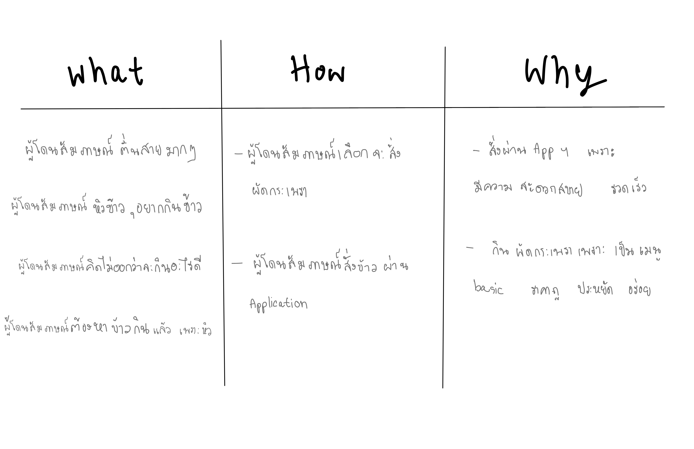
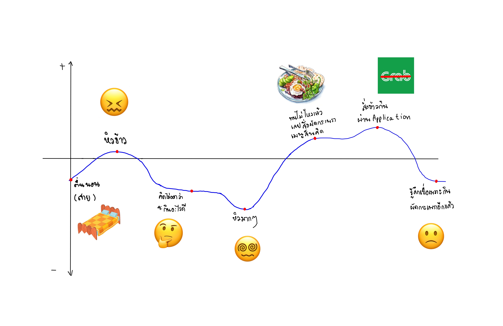

### What/How/Why - Table :

---
### SAY-DO-THINK-FEEL FROM THE INTERVIEW :camera:

:pushpin: **SAY**
- ผู้โดนสัมภาษณ์ สัมภาษณ์ว่า เขาหิวข้าวแล้วคิดเมนูนานมาก คิดไม่ออกทำให้เขาหิวหนักกว่าเดิม

:pushpin: **DO**
- ผู้โดนสัมภาษณ์ เลือกสั่งผัดกระเพราผ่านทาง application

:pushpin: **THINK** 
- ผู้โดนสัมภาษณ์รู้สึกว่าขณะพูดถึงเรื่องของตัวเองวันก่อนหน้านี้ผู้โดนสัมภาษณ์นอนดึก อาจจะเป็นเพราะปัจจัยหลายๆอย่างเช่น เล่นเกม ดูหนัง หรือนอนไม่หลับ ก็มีปัจจัยหลายๆอย่างออกไปที่ทำให้ผู้โดนสัมภาษณ์ตื่นสาย จากนั้นตื่นมาก็หิวข้าว และคิดไม่ออกว่าตัวเองจะกินอะไรแต่ตัวเองก็หิวมากๆ จากนั้นผู้โดนสัมภาษณ์ก็ทนไม่ได้เลยสั่งข้าวผัดกระเพราที่เป็นเมนูน่าเบื่อมากๆสำหรับเขา เขาสั่งอาหารผ่าน Appication และรู้สึกว่าตัวเองจะต้องกินร้านเดิมอีกเเล้วเป็นอะไรที่เบื่อมากๆ แต่ที่ผู้โดนสัมภาษณ์กินร้านนี้บ่อยๆและกินเป็นประจำก็อาจจะเป็นเพราะว่าร้านอื่นหรีออาหารจานเดี่ยวอย่างอื่นอาจมีราคาทีเเพงและคิดก็ไม่ออกว่าจะกินอะไรเหมือนเดิม ก็เลยกินของที่ง่าย ถูก และอิ่มท้อง

:pushpin: **FEEL**
- ผู้โดนสัมภาษณ์รู้สึกหิวมากและรู้สึกเบื่อที่ต้องตื่นสายและต้องสั่งอาหารเมนูเดิมๆ ร้านเดิมๆ appication เดิมๆเหมือนในทุกๆวัน ผู้โดนสัมภาษณ์คงรู้สึกว่าบางวันอาจจะกินอาหารที่ใกล้บ้านจะได้กินเมนูที่หลากหลายและเเปลกใหม่จะได้ไม่ต้องรอนาน อีกอย่างนึงผู้โดนสัมภาษณ์รู้สึกว่าที่ตัวเองนอนตื่นสายเพราะตัวเองมีปัจจัยหลายอย่างที่ทำให้นอนดึก หลังจากนี้ผู้โดนสัมภาษณ์ก็จะปรับเวลานอนให้ไวขึ้นจะได้ไม่นอนตื่นสาย

---
###  journey map from interview :curry:

---
### Feedback  :circus_tent:

| **I like** :two_hearts: | **I wish** :boom: |
| --------- | ---------- |
|  *1. เนื้อเรื่องเข้าใจง่าย*  |  *1. อยากให้เพิ่มกิจกรรม*  |
|  *2. Life cycle น่าสนใจ*  |  *2. อยากให้เรื่องราวน่าสนใจกว่านี้* |
|*3. ทุกคนเข้าถึงง่าย*  | *3. เกี่ยวกับชีวิตทั่วไป* |
|  *4. เข้าใจที่จะสื่อ*   |  *4. คิดเมนูนานเกินไป*  |

---
### Revised journey map from feedback :christmas_tree:

---
### Identified *insights* :arrow_right: 
ผู้โดนสัมภาษณ์คิดเมนูอาหารนานเกินไป ผู้โดนสัมภาษณ์จึง **หิวมาก** :heavy_exclamation_mark:

---
## POV :eyes: :

**1. We met :** 

* *ผู้โดนสัมภาษณ์ผู้หิวโหยจากการที่ตื่นสายจนเลยเวลาอาหาร*

**2. We were surprised to notice :** 

* *ผู้โดนสัมภาษณ์คิดเมนูนานเกิน เพราะมัวแต่คิดว่าเมนูในแอปมันอร่อยรึป่าว แต่สุดท้ายก็สั่งกะเพราเช่นเดิม*

**3. We wonder if this means :** 

* *ผู้โดนสัมภาษณ์คิดเมนูอาหารนานเกินไปจึงทำให้หิวมากและสั่งเมนูสิ้นคิดไปโดยไม่ได้ตั้งตัว*

**4. It would be game-changing to :** 

* *ถ้าผู้โดนสัมภาษณ์ไม่คิดนานเกินไป ผู้โดนสัมภาษณ์ก็จะไม่หิวมากจนทำให้สั่งเมนูเดิมๆ*

**ใบหม่อน** :sob:
> *สร้าง repo,issue,draw journey map*

**แพรไหม** :grey_exclamation:
> คิดและระบุ *Identified insights*, ตรวจสอบงานส่วน *POV* และ *SAY/DO/THINK/FEEL*, *Draw journey map*

**พี** 🍔
> นัดหมายเวลาประชุม ทำตาราง what how why ตรวจสอบงานส่วน journeymap draw journey map

**กาย** 🐤
> ทำPOV, เล่าเรื่อง, draw journey map

**อาร์ม🐬**
> SAY/DO/THINK/FEEL,draw journey map,ทำตาราง I like I wish

**ฮาร์ท**💘
> เปิดบทสนทนา,คิดกับตกแต่งและตรวจสอบงานส่วน POV,draw journey map

**เอิน**:frog: 
> ทำ insights, จดบันทึกการประชุม, draw journey map
